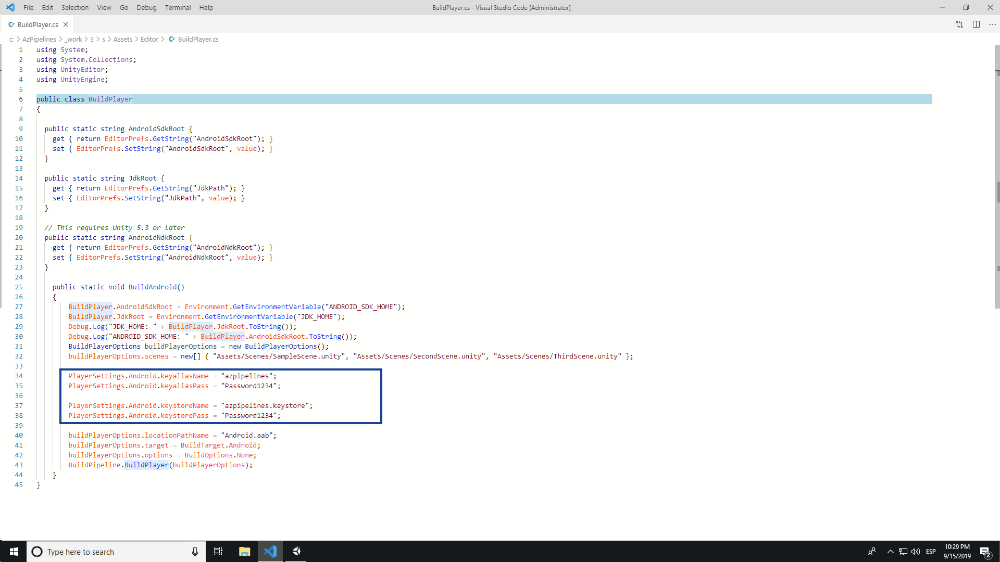
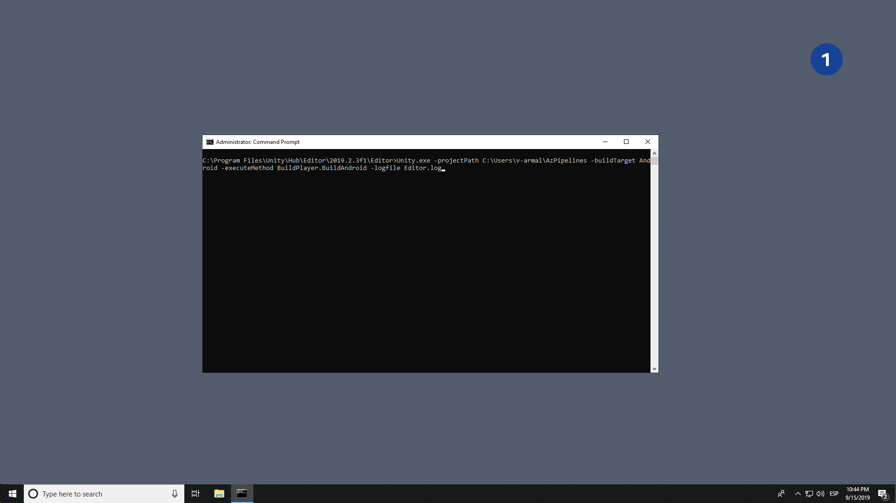
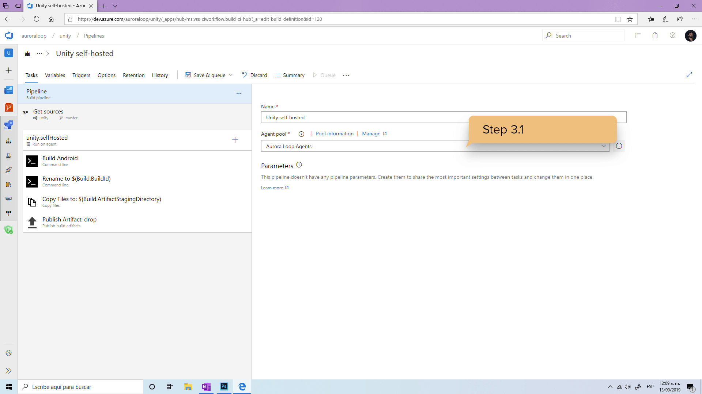

# Build Unity mobile projects using Azure DevOps: Android
Even before discovering the DevOps world, game development and CGI have always been of great interest for me. I got started with [Unity](https://unity.com/) more than 4 years ago while doing some AR and VR applications meant to display the classic sculpture collections of the first formal art academy in America: [La Antigua Academia de San Carlos](http://academiasancarlos.unam.mx/) in Mexico City.

Back then I knew absolutely nothing about CI and CD, we would 3D scan all the sculptures, manage the files using external drives and with every new update to the app we would meet at the house of a Mac computer owner to build the iOS version of our app.

You can only then imagine how enlightening was the introduction of [Azure DevOps Services](https://azure.microsoft.com/en-in/services/devops/) for me. When I joined the team, I wanted to share some ways in which I'm using Azure Pipelines in Unity development to leverage game and code quality using continuous integration (CI) with [Azure Pipelines](https://azure.microsoft.com/en-us/services/devops/pipelines/). In this post, I will target [Android](https://docs.unity3d.com/Manual/android-GettingStarted.html) builds.

### Prerequisites:
- [x] A computer with Unity installed, no OS restrictions.
- [x] An Azure DevOps [self-hosted agent](https://docs.microsoft.com/en-us/azure/devops/pipelines/agents/v2-windows?view=azure-devops) installed in your computer, if you don't have one follow the docs to get one installed or ping the [support team](https://azure.microsoft.com/en-us/support/devops/) to get help installing one.

### Remarks:
- [x] There is **no** need of a Unity Plus/Pro license
- [x] All Unity scenes must be made out of [prefabs](https://unity.com/prefabs) or else the scene will be missing all non-prefab objects when building using a pipeline.

### 1. The build class and method for the Player Settings
When building in an Azure Pipeline we'll make use of a customized script to build the Android project with control over the Project and Player settings.  

**1.1)** In your Unity project folder, under Assets, add a folder called **Editor** and add a [C#](https://docs.unity3d.com/Manual/CreatingAndUsingScripts.html) script to it, call it **BuildPlayer.cs**:  
**1.2)** Paste the following in your new generated .cs file. This is just a class with a build method in it which we'll call from an Azure Pipeline later on:

``` csharp
using System;
using System.Collections;
using UnityEditor;
using UnityEngine;

public class BuildPlayer
{

  public static string AndroidSdkRoot {
    get { return EditorPrefs.GetString("AndroidSdkRoot"); }
    set { EditorPrefs.SetString("AndroidSdkRoot", value); }
  }

  public static string JdkRoot {
    get { return EditorPrefs.GetString("JdkPath"); }
    set { EditorPrefs.SetString("JdkPath", value); }
  }

  public static string AndroidNdkRoot {
    get { return EditorPrefs.GetString("AndroidNdkRoot"); }
    set { EditorPrefs.SetString("AndroidNdkRoot", value); }
  }

    public static void BuildAndroid()
    {
        EditorSetup.AndroidSdkRoot = Environment.GetEnvironmentVariable("ANDROID_SDK_HOME");
        EditorSetup.JdkRoot = Environment.GetEnvironmentVariable("JDK_HOME");
        Debug.Log("JDK_HOME: " + EditorSetup.JdkRoot.ToString());
        Debug.Log("ANDROID_SDK_HOME: " + EditorSetup.AndroidSdkRoot.ToString());
        BuildPlayerOptions buildPlayerOptions = new BuildPlayerOptions();
        buildPlayerOptions.scenes = new[] { "Assets/Scenes/SampleScene.unity", "Assets/Scenes/SecondScene.unity", "Assets/Scenes/ThirdScene.unity" };

        // These settings will be used to sign the generated .aab package
        PlayerSettings.Android.keyaliasName = "azpipelines";
        PlayerSettings.Android.keyaliasPass = "Password1234";
        PlayerSettings.Android.keystoreName = "azpipelines.keystore";
        PlayerSettings.Android.keystorePass = "Password1234";

        // This will be the name of the generated .aab Android package
        buildPlayerOptions.locationPathName = "Android.aab";
        buildPlayerOptions.target = BuildTarget.Android;
        buildPlayerOptions.options = BuildOptions.None;
        BuildPipeline.BuildPlayer(buildPlayerOptions);
    }
}
```

**1.3)** Replace highlighted values with the paths and names of your scenes (.unity files) relative to the root of the repository. The signing settings must be equal to the ones you would use when building from the Editor, e.g.



### 2. Debugging
Before bringing Azure DevOps into the ecuation, it is good practice to be sure our project and script compiles fine locally. 

**2.1)** Locate the parent folder path for your Unity.exe (Windows) / Unity.app (MacOS) file. If you're using Unity Hub it would be probably as following:

```
# On Windows:  
C:\"Program Files"\Unity\Hub\Editor\2019.2.3f1\Editor\
```
```
# On Mac:  
/Applications/Unity/Hub/Editor/2019.1.9f1/Unity.app/Contents/MacOS/Unity
```

**2.2)** Open a CMD (Windows) / Terminal (macOS) at the path of the parent folder for your Unity.exe/.app and run the following command:  

```
# On Windows:
Unity.exe -projectPath <UnityProjectPath> -buildTarget <Name> -executeMethod <ClassName.MethodName> -logfile <pathname>
```
```
# On MacOS:
/Applications/Unity/Hub/Editor/2019.1.9f1/Unity.app/Contents/MacOS/Unity -projectPath <UnityProjectPath> -buildTarget <Name> -executeMethod <ClassName.MethodName> -logfile <pathname>
```
Where (from [Unity docs](https://docs.unity3d.com/Manual/CommandLineArguments.html)):  
| Arguments | Description | 
|-----------|-----------|
| -projectPath <UnityProjectPath> | Open the project at the given path. | 
| -buildTarget <Name> | Win, Win64, OSXUniversal, Linux, Linux64, LinuxUniversal, iOS, Android, Web, WebStreamed, WebGL, XboxOne, PS4, WindowsStoreApps, Switch, N3DS, tvOS. |
| -executeMethod <ClassName.MethodName> | <ClassName.MethodName> This will be the argument where we call the previously created BuildPlayer.cs script |
| -logFile <pathname> | Specify where Unity writes the Editor or Windows/Linux/OSX standalone log file. To output to the console, specify - for the path name. On Windows, specify - option to ensure output goes to stdout, which is not the console by default. |

```
# e.g. (Windows)
Unity.exe -projectPath C:\Users\v-armal\AzPipelines -buildTarget Android -executeMethod BuildPlayer.BuildAndroid -logfile Editor.log
```
```
# e.g. (MacOS)
/Applications/Unity/Hub/Editor/2019.1.9f1/Unity.app/Contents/MacOS/Unity -projectPath /Users/v-armal/src/AzPipelines -buildTarget Android -executeMethod BuildPlayer.BuildAndroid -logfile Editor.log
```
This will throw up a Unity Editor instance and attempt to build an .aab package with the signing options given in the BuildAndroid method from step **1.2.** If your project fails to compile resolve the errors thrown in the console window of Unity. If the build process is successful an .aab package will be generated in the root of the repository, we're now ready to bring Azure DevOps into the ecuation.



> Tip:  
> Make sure the .keystore file exists in the root of your local repository.

> Tip:  
> On the computer where the agent is installed, verify Unity has the SDK, NDK and JDK paths set. Go to menu Edit -> Preferences, you should see JDK, SDK and NDK tools installed with Unity (recommended). If you don't see these follow the [Unity docs](https://docs.unity3d.com/Manual/android-sdksetup.html) to get these installed.  

# 3. Implementing CI with Azure Pipelines
Push your repository up into [Azure Repos](https://azure.microsoft.com/en-us/services/devops/repos/), make sure you don't ignore any build-necessary files in your .gitignore file. Feel free to design your .gitignore file based on [mine](https://dev.azure.com/auroraloop/_git/unity?path=%2F.gitignore&version=GBmaster) and add any file/file extension to it according to your needs.

> Tip:  
> Make sure the .keystore file is part of the repository. If you would not like to have it added in source control add it as a [secure file](https://docs.microsoft.com/en-us/azure/devops/pipelines/library/secure-files?view=azure-devops) to the Azure Pipelines library and download it as a first task into the agent using the [Download Secure File](https://docs.microsoft.com/en-us/azure/devops/pipelines/tasks/utility/download-secure-file?view=azure-devops) task which is Microsoft supported.

**3.1)** Create a pipeline pointing to your repository and set the Agent pool to the pool containing your self-hosted agent.  
**3.2)** Build Android Unity project

| For Windows self-hosted agents | For MacOS self-hosted agents | 
|-----------|:-----------|
| Add a **Command line** task - with inline script| Add a **Bash** task - with inline script | 
| cd C:\"Program Files"\Unity\Hub\Editor\2019.2.3f1\Editor
Unity.exe -projectPath %BUILD_REPOSITORY_LOCALPATH% -buildTarget Android -executeMethod BuildPlayer.BuildAndroid -logfile Editor.log -quit | /Applications/Unity/Hub/Editor/2019.1.9f1/Unity.app/Contents/MacOS/Unity -projectPath %BUILD_REPOSITORY_LOCALPATH% -buildTarget Android -executeMethod BuildPlayer.BuildAndroid -logfile Editor.log -quit | 

> Tip:  
> The %BUILD_REPOSITORY_LOCALPATH% variable with be assigned the value for the path of the repository linked to the pipeline in the agent's local directory. 

> Tip:  
> Note how I added the -quit argument to the build command. This will kill Unity once the build process is completed.

**3.3)** Rename the .aab generated
Rename the generated .aab package from the command line in the agent to follow your name versioning conventions. [Predefined variables](https://docs.microsoft.com/en-us/azure/devops/pipelines/build/variables?view=azure-devops&tabs=yaml) are very useful for this purpose, I will rename mine using the Build.BuildId predefined variable. This is an incremental integer number for each pipeline run with a count at an organization level.

| For Windows self-hosted agents | For MacOS self-hosted agents |
|-----------|:-----------|
| Add a **Command line** task - with inline script | Add a **Bash** task - with inline script|  
| rename "$(Build.Repository.LocalPath)\Android.aab" "$(Build.BuildId).aab" | mv $(Build.Repository.LocalPath)/Android.aab $(Build.BuildId).aab |

**3.4)** Copy the .aab package into the %BUILD_ARTIFACTSTAGINGDIRECTORY%
The build artifact staging directory is a directory in the agent that must be used to host all files intended to be published as an artifact in Azure pipelines. We want to add the .aab generated package.

For Windows and MacOS self-hosted agents
Add a Copy Files task

**Contents:** **/*.aab  
**Target Folder:** $(Build.ArtifactStagingDirectory)


**3.5)** Publish the .aab file as an Azure pipeline artifact  
Publishing your .aab package as an Azure pipeline build artifact will allow you to keep a record for all packages compiled using pipelines. It will also allow you to deploy it into App Center for testing or straight into Google Play Console using Azure Release pipelines. We will publish the build staging directory where our .aab package will exist when the pipeline reaches this point.

For Windows and MacOS self-hosted agents
Add a [Publish a Build artifact](https://docs.microsoft.com/en-us/azure/devops/pipelines/tasks/utility/publish-build-artifacts?view=azure-devops) task

**Path to publish:** $(Build.ArtifactStagingDirectory)  
**Artifact name:** could be anything, 'drop' is set by default  
**Artifact publish location:** Azure Pipelines  



We're so excited to see the game developer community bringing their work into our product for CI/CD. Being myself a game developer hobbyist from a while ago, honestly, I don't know how I made it through in the beginning without the DevOps workflow and Azure DevOps amazing features. I am confident these will as well come naturally to a big fraction of the game dev community.

If you step into any hoop while implementing do not hesitate to reach out to the [Azure DevOps support team](https://azure.microsoft.com/en-us/support/devops/) for help. Even though Unity debugging actions are not supported we'll make our best effort ;). Hands down we can help you out designing your pipeline, installing your agent and pushing your repository up into [Azure Repos](https://azure.microsoft.com/en-us/services/devops/repos/) to get started!

On the other hand, if you've completed all the steps you should move on to [configure a continuous delivery pipeline](https://docs.microsoft.com/en-us/azure/devops/pipelines/ecosystems/android?view=azure-devops#deploy) to deploy the generated packages to [App center](https://appcenter.ms/) for testing or straight into [Google Play Store](https://play.google.com/apps/publish/) for distribution, all from within Azure DevOps!